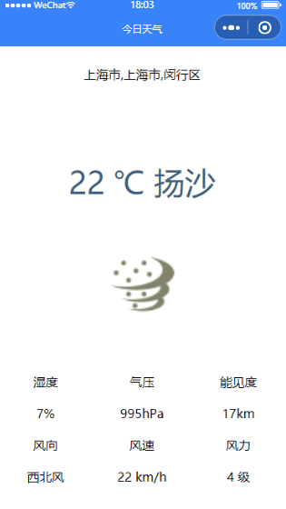
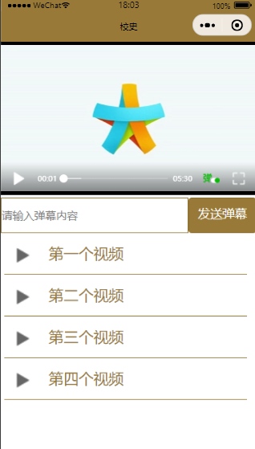

# Demo1_获取用户信息


- 推荐使用wx.getUserProfile获取用户信息，开发者每次通过该接口获取用户个人信息均需用户确认

- 开发者妥善保管用户快速填写的头像昵称，避免重复弹窗

```js
getUserProfile(e) {
    wx.getUserProfile({
      desc: '用于完善会员资料', // 声明获取用户个人信息后的用途，后续会展示在弹窗中，请谨慎填写
      success: (res) => {
        console.log(res.userInfo);
        this.setData({
          userInfo: res.userInfo,
          hasUserInfo: true,
          defaultImg: res.userInfo.avatarUrl,
          defaultText: res.userInfo.nickName
        })
      }
    })
  },
```

# Demo2_获取天气



- 使用和风天气API

> https://dev.qweather.com/

- 城市信息查詢

> https://dev.qweather.com/docs/api/geo/city-lookup/

- 实时天气查询

> https://dev.qweather.com/docs/api/weather/weather-now/

- 创建应用和Key

> https://dev.qweather.com/docs/start/get-key/

# Demo3_视频播放



- video组件说明

| 属性名               | 类型         | 默认值  | 说明                                                         |
| -------------------- | ------------ | ------- | ------------------------------------------------------------ |
| src                  | String       |         | 要播放视频的资源地址                                         |
| initial-time         | Number       |         | 指定视频初始播放位置                                         |
| duration             | Number       |         | 指定视频时长                                                 |
| controls             | Boolean      | true    | 是否显示默认播放控件（播放/暂停按钮、播放进度、时间）        |
| danmu-list           | Object Array |         | 弹幕列表                                                     |
| danmu-btn            | Boolean      | false   | 是否展示弹幕按钮，只在初始化时有效，不能动态变更             |
| enable-danmu         | Boolean      | false   | 是否展示弹幕，只在初始化时有效，不能动态变更                 |
| autoplay             | Boolean      | false   | 是否自动播放                                                 |
| loop                 | Boolean      | false   | 是否循环播放                                                 |
| muted                | Boolean      | false   | 是否静音播放                                                 |
| page-gesture         | Boolean      | false   | 在非全屏模式下是否开启亮度与音量调节手势                     |
| direction            | Number       |         | 设置全屏时视屏的方向，不指定则根据宽高比自动判断，其有效值为0（正常竖向）、90（屏幕逆时针90°）、-90（屏幕顺时针90°） |
| show-progress        | Boolean      | true    | 若不设置，当宽度大于240时才会显示                            |
| show-fullscreen      | Boolean      | true    | 是否显示全屏按钮                                             |
| show-play-btn        | Boolean      | true    | 是否显示视频底部控制栏中播放按钮                             |
| show-center-play-btn | Boolean      | true    | 是否显示视频中间的播放按钮                                   |
| objectFit            | String       | contain | 当视频大小与video容器大小不一致的时候，视频的表现形式，contain为包含、fill为填充、cover为覆盖 |
| poster               | String       |         | 视频封面图片网络资源视频地址，如果controls属性值为false，则设置poster无效 |
| bindplay             | EventHandle  |         | 当开始/继续播放时触发play事件                                |
| bindpause            | EventHandle  |         | 当暂停播放时触发pause事件                                    |
| bindended            | EventHandle  |         | 当播放到末尾时触发ended事件                                  |
| bindtimeupdate       | EventHandle  |         | 当播放进度变化时触发，`event.detail={currentTime,duration}`，触发频率为250ms一次 |
| bindfullscreenchange | EventHandle  |         | 当视频进入和退出全屏时触发，`event.detail={fullScreen,direction}`，direction取值为vertical和horizontal |
| bindwaiting          | EventHandle  |         | 当视频出现缓冲时触发                                         |
| binderror            | EventHandle  |         | 当视频播放出错时触发                                         |